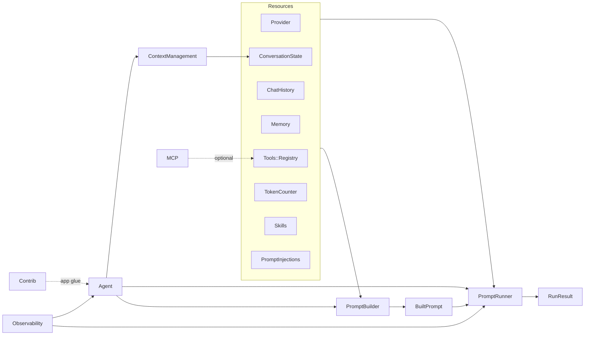

# AgentCore audit — Surface/API + Orthogonality (Round 1)

Date: 2026-02-16
Scope: `vendor/agent_core/**` + `lib/agent_core/contrib/**`

This document audits AgentCore's **public surface** (what a host app can call),
and the **relationships between components**, with emphasis on **orthogonality**
(each component has one job, minimal overlap, one-way flow).

---

## 1) Scope & goals

### Scope

- Gem core: `vendor/agent_core/lib/agent_core/**`
- App-side helpers (contrib): `lib/agent_core/contrib/**`

### Goals

- Make surfaces explicit and small (avoid “requires load everything”).
- Strengthen one-way data flow (Resources → PromptBuilder → PromptRunner → Agent).
- Reduce reach-through coupling (especially ContextManagement ↔ Agent internals).
- Remove redundancy / unused code paths.
- Keep behavior stable via tests.

---

## 2) Component inventory (surface map)

Each entry lists: responsibility, surface, inputs/outputs, and dependencies.

### Core

#### `AgentCore::Agent`

- Responsibility: top-level orchestrator (prompt build + run + chat history updates).
- Surface:
  - `.build { |b| ... }`
  - `.from_config(config, provider:, ...)`
  - `#chat`, `#chat_stream`
  - `#resume`, `#resume_stream`
  - `#resume_with_tool_results`, `#resume_stream_with_tool_results`
  - `#to_config`, `#reset!`
- Inputs/Outputs:
  - Input: user message + optional `ExecutionContext`
  - Output: `PromptRunner::RunResult` (may be paused)
- Depends on: PromptBuilder pipeline, PromptRunner, Resources adapters, ContextManagement (token budget + compaction).

#### `AgentCore::ExecutionContext`

- Responsibility: per-run context bag (run_id + attributes + instrumenter + clock).
- Surface:
  - `.from(nil|Hash|ExecutionContext, instrumenter:, **attributes)`
- Inputs/Outputs:
  - Input: Symbol-keyed Hash (internal convention) or `ExecutionContext`
  - Output: immutable `ExecutionContext` (Data object)
- Depends on: Observability instrumenter interface; Utils symbol-key assertions.

#### `AgentCore::Message` (+ `ToolCall`, `ContentBlock` types) and `AgentCore::StreamEvent`

- Responsibility:
  - Message: provider-neutral conversation payload (Anthropic-style content blocks).
  - ToolCall: normalized tool call request (string-keyed arguments).
  - StreamEvent: streaming events for text/tool calls/turn lifecycle.
- Surface: constructors + `#to_h`/`.from_h`, helpers like `#text`, `#has_tool_calls?`.
- Depends on: Utils for deep stringify/symbolize; Configuration for media URL policy.

#### `AgentCore::Utils`, `AgentCore::Configuration`, `AgentCore::Error` subclasses

- Responsibility: cross-cutting helpers, global policy toggles, typed error taxonomy.
- Surface: JSON/tool-args parsing helpers; MIME inference; MCP normalization helpers.
- Depends on: stdlib + optional Marcel (for MIME inference).

### Resources

#### Provider (`AgentCore::Resources::Provider::*`)

- Responsibility: adapter layer for LLM APIs.
- Surface:
  - `Provider::Base#chat(messages:, model:, tools:, stream:, **options)`
  - `Provider::Response` (message + usage + stop_reason)
  - Optional `SimpleInferenceProvider` (OpenAI-compatible)
- Inputs/Outputs:
  - Input: AgentCore Message list + tool defs + options
  - Output: `Provider::Response` or stream enumerator yielding `StreamEvent`
- Depends on: Message/ToolCall conversions; Runner consumes this contract.

#### Tools (`AgentCore::Resources::Tools::*`)

- Responsibility:
  - `Tool`: native tool definition + safe execution wrapper
  - `ToolResult`: normalized content blocks + error flag + metadata
  - `Registry`: unified tool discovery/execution (native + MCP + skills tools)
  - `Policy`: tool visibility + authorization decision (allow/deny/confirm)
- Surface:
  - `Registry#register`, `#register_many`, `#register_skills_store`, `#register_mcp_client`
  - `Registry#definitions(format:)`, `#execute(...)`
  - `Policy::Base#filter`, `#authorize`
- Inputs/Outputs:
  - Tools accept arguments Hash (string keys preferred) + `ExecutionContext`
  - Results are `ToolResult` (or error ToolResult)
- Depends on:
  - PromptBuilder uses Registry definitions (filtered by policy) for tool schema.
  - PromptRunner executes via Registry and Policy decisions.
  - MCP integration is optional (see “MCP load surface” below).

#### ChatHistory / ConversationState / Memory / TokenCounter / Skills / PromptInjections

- ChatHistory:
  - Responsibility: app-owned transcript storage (Enumerable, append/clear/size).
  - Surface: `Base` interface; `InMemory` reference impl + `#replace_message`.
- ConversationState:
  - Responsibility: small persisted state managed by AgentCore (summary + cursor).
  - Surface: `State`, `Base#load/#save/#clear`, `InMemory`.
- Memory:
  - Responsibility: app-owned long-term context store (search/store/forget).
  - Surface: `Base` interface; `InMemory` reference impl.
- TokenCounter:
  - Responsibility: app-owned tokenizer; AgentCore ships heuristic fallback.
  - Surface: `Base` interface; `Heuristic`.
- Skills:
  - Responsibility: progressive disclosure store + tool wrappers (`skills.list/load/read_file`).
  - Surface: `Store` interface; `FileSystemStore`; `Skills::Tools.build`.
- PromptInjections:
  - Responsibility: optional system/preamble injections (repo docs, file sets, app-provided items).
  - Surface: `Item` value object; `Sources::*`; `Factory.build_sources`.

### PromptBuilder

#### `AgentCore::PromptBuilder::*`

- Responsibility: prompt assembly pipeline (pure-ish; no tool execution).
- Surface:
  - `Pipeline#build(context:)`
  - `SimplePipeline` default implementation
  - `Context` DTO and `BuiltPrompt`
- Depends on: Resources inputs (history, tools registry, skills store, injections items).

### PromptRunner

#### `AgentCore::PromptRunner::*`

- Responsibility: tool-calling loop and pause/resume execution engine.
- Surface:
  - `Runner#run`, `#run_stream`
  - `Runner#resume`, `#resume_stream`
  - `Runner#resume_with_tool_results`, `#resume_stream_with_tool_results`
  - `RunResult` + trace value objects + `Continuation`
  - `ContinuationCodec` + `ToolTaskCodec`
  - `ToolExecutor` strategies: `Inline`, `ThreadPool`, `DeferAll`
  - `Events` callbacks
- Inputs/Outputs:
  - Input: `BuiltPrompt`, provider, tools registry, policy, executor
  - Output: `RunResult` (final or paused) + continuation for resumption
- Depends on: Provider contract, Tools Registry/Policy, Observability Instrumenter.

### ContextManagement

- Responsibility: keep prompt within token budget via sliding window + optional compaction summary persisted in `ConversationState`.
- Surface (Round 1): `ContextManagement::BudgetManager` (internal helper used by `Agent`).
- Coupling note (fixed): budgeting/compaction no longer builds prompts directly; `Agent` owns prompt assembly and passes a callable.

### Observability

- Responsibility: instrumentation interface + adapters (`NullInstrumenter`, `TraceRecorder`).
- Surface: `Instrumenter#instrument/#publish`, adapters under `observability/adapters`.
- Depends on: none (library-agnostic).

### MCP (Model Context Protocol)

- Responsibility: optional MCP client stack (transport + JSON-RPC + tool name mapping).
- Surface: `AgentCore::MCP::*` (Client, transports, ToolAdapter).
- Load-surface note: MCP is optional and should not be loaded unless used.

### Contrib (app-side glue)

#### `AgentCore::Contrib::AgentSession`

- Responsibility: “easy mode” wrapper around AgentCore for Rails app flows:
  - history coercion (OpenAI-like) → AgentCore Messages
  - request defaults wrapper for provider options
  - optional language policy rewrite for final output
  - directives runner helpers
- Surface: `#chat`, `#chat_stream`, `#resume*`, `#directives`.
- Depends on: `AgentCore::Agent` + Contrib helpers (ProviderWithDefaults/OpenAIHistory/etc.).

#### Directives / LanguagePolicy / ProviderWithDefaults / OpenAIHistory / TokenEstimation

- Responsibility: app-specific structured output patterns and token estimation stack.
- Surface: Contrib modules/classes under `lib/agent_core/contrib/**`.
- Depends on: AgentCore core, but should avoid leaking back into gem core.

---

## 3) Dependency graph

### Intended one-way flow

### Current “unhappy” edges (orthogonality breaks)

- (Pre-Round 1) ContextManagement reached into `Agent` internals to build prompts (mixed orchestration + budgeting + assembly).
- (Pre-Round 1) `require "agent_core"` loaded MCP by default (inflated load surface for users who do not use MCP).

---

## 4) Findings (top issues)

### P0 — Design: ContextManagement is not orthogonal

- Symptom: `ContextManagement::ContextManager` owns too much:
  - prompt-mode resolution
  - prompt injections collection
  - memory search
  - token budgeting loop + drop strategy
  - compaction summary generation + persistence
  - prompt assembly (via PromptBuilder Context)
- Impact: hard to evolve and reason about; increases coupling to `Agent` internals and makes reuse/testing awkward.

Status (Round 1): fixed by introducing `ContextManagement::BudgetManager` and moving prompt assembly + injections + memory fetch into `Agent`.

### P1 — API footgun: MCP is loaded implicitly

- Symptom: `require "agent_core"` loads MCP stack (transports + JSON-RPC client).
- Impact:
  - larger default surface area and boot cost
  - optional deps become more likely to conflict
  - users who never use MCP pay for it anyway

Status (Round 1): fixed — MCP is opt-in via `require "agent_core/mcp"`; tools registry lazy-loads on `#register_mcp_client`.

### P2 — Redundancy/dead: Tools::Registry stores unused MCP client bookkeeping

- Symptom: `@mcp_clients` is maintained but never used.
- Impact: noise and future confusion (implied lifecycle management that does not exist).

Status (Round 1): fixed — removed unused state.

---

## 5) Refactor implemented (Round 1)

### 5.1 Make MCP explicit opt-in

- Implemented:
  - `require "agent_core"` no longer loads MCP.
  - MCP users must `require "agent_core/mcp"`.
  - `Tools::Registry#register_mcp_client` lazy-loads MCP.

### 5.2 Remove unused MCP bookkeeping in Tools::Registry

- Implemented: deleted `@mcp_clients` state and related code.

### 5.3 Split ContextManagement into “budget/compaction” vs “prompt assembly”

- Implemented:
  - Introduced `ContextManagement::BudgetManager` (token budgeting loop + state persistence + compaction).
  - Moved prompt assembly concerns into `Agent#build_prompt`:
  - resolve prompt_mode from `ExecutionContext`
  - collect prompt injection items from sources
  - fetch memory results
  - provide a `build_prompt(summary:, turns:, memory_results:)` closure to BudgetManager
  - Stopped exporting/using `ContextManagement::ContextManager` as a default surface (not required by default).

---

## 6) Checklist

### Docs

- [x] Add `docs/agent_core/audit_surface_orthogonality_2026-02-16.md`
- [x] Update `vendor/agent_core/README.md` to document MCP explicit require

### MCP opt-in

- [x] Remove `require_relative "agent_core/mcp"` from `vendor/agent_core/lib/agent_core.rb`
- [x] Add lazy-load hook in `vendor/agent_core/lib/agent_core/resources/tools/registry.rb#register_mcp_client`
- [x] Remove unused `@mcp_clients` from `vendor/agent_core/lib/agent_core/resources/tools/registry.rb`

### ContextManagement orthogonality

- [x] Add `vendor/agent_core/lib/agent_core/context_management/budget_manager.rb`
- [x] Refactor `vendor/agent_core/lib/agent_core/agent.rb` to orchestrate prompt building and delegate budget loop
- [x] Update requires in `vendor/agent_core/lib/agent_core.rb`
- [x] Remove or de-surface `context_manager.rb` (no longer required by default)

### Tests

- [x] Update MCP tests to `require "agent_core/mcp"` explicitly
- [x] Replace `ContextManagerTest` with Agent-level prompt injection tests
- [x] Add load-surface test asserting `require "agent_core"` does not load MCP (`AgentCore::MCP::Client` / `ToolAdapter`)

### Verification

- [x] `cd vendor/agent_core && bundle exec rake`
- [x] `bin/rails test test/lib/agent_core/contrib`
- [ ] Optional: `bin/ci`
